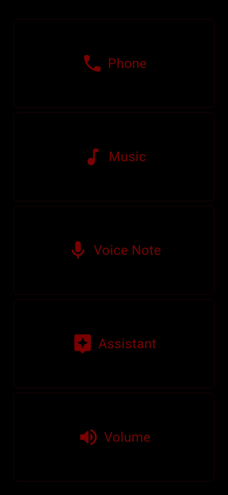
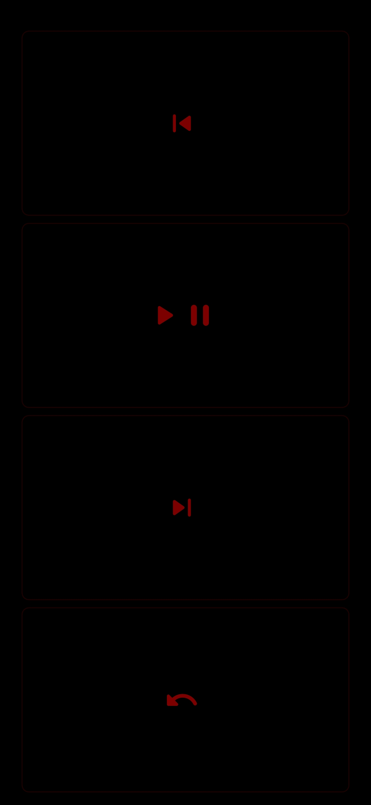
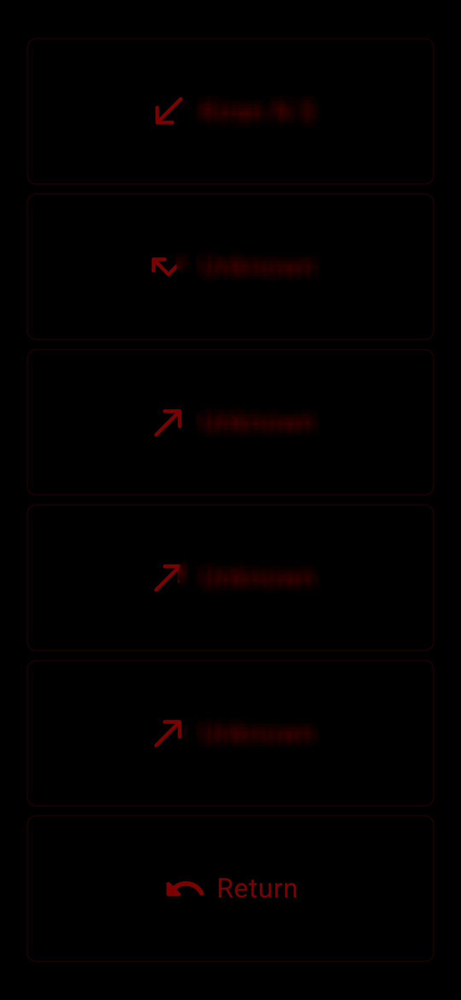
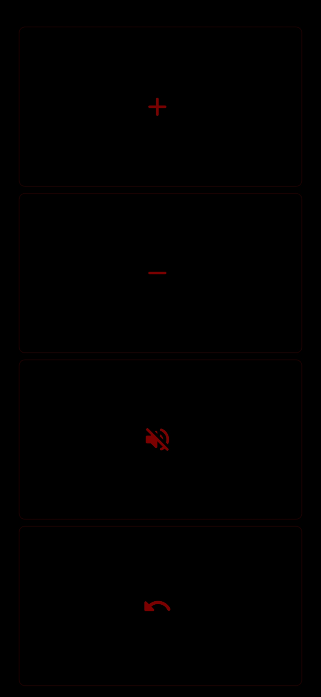

# moto_dash

**moto_dash** is a minimal, glove-friendly Android application designed for motorcycle riders.

It provides a simple, fast, and distraction-reduced interface for common actions like calls, music control, assistant triggering, volume control, and quick voice notes. The app is intended to be used while the phone is mounted on the motorcycle and the rider is wearing gloves.

---

## Why moto_dash exists

While riding, I found it difficult to reliably control my phone using gloves—even with Android “Easy Mode”, enlarged UI elements, and increased touch sensitivity on my Samsung device. The interfaces were still complex, required multiple taps, caused frequent screen timeouts, and felt distracting.

After observing how Android Auto prioritizes minimalism and function, I wanted something similar—but tailored for a motorcycle setup: large buttons, predictable behavior, no visual noise, and a strong focus on battery efficiency.

moto_dash is built to solve that problem for myself and others with similar needs.

---

## Core design principles

- Always On (with screen-saver)
- Glove-friendly UI with large touch targets
- Minimal and distraction-reduced
- Fast and predictable behavior
- Battery-efficient, especially for long rides
- AMOLED-first design (recommended, not enforced)
- No animations, simple lines and icons

---

## Feature overview

### Feature screen order (fixed)

1. Call  
2. Music  
3. Voice Note  
4. Assistant  
5. Volume  

This order is intentional and optimized for quick access while riding.

---

### Call

- Call favorite contacts (maximum 5, enforced to keep buttons large)
- Access call log

### Music

- Previous
- Play / Pause
- Next

### Voice Note

- Quick capture for ideas while riding
- Work in progress

### Assistant

- Triggers the system voice assistant
- Implemented using the Android voice command intent via native Kotlin integration

### Volume

- Volume Up
- Volume Down
- Mute
- Double-tap the on-screen volume button to open settings  
  (This is not the hardware volume button)

---

## Screen saver and burn-in protection

To reduce the risk of OLED burn-in, moto_dash includes a built-in screen saver.

- A single dot moves across the screen
- The same delay controls:
  - When the screen saver starts
  - How often the dot moves
- A single tap exits the screen saver

Note: due to the current implementation, exiting the screen saver may require multiple taps. This will be simplified in a future update.

Enabling the screen saver is strongly recommended, as other screens do not implement burn-in prevention logic.

---

## Brightness handling

- Supports Android system auto-brightness
- Supports manual brightness override
- Auto-brightness uses Android’s native settings
- AMOLED screens benefit the most from this design

---

## Settings

### How to access settings

- Double-tap the on-screen volume button

### Available settings

- Show labels or icons only on feature screens (power saving)
- Select favorite contacts (maximum 5)
- Screen brightness (manual or auto)
- Enable or disable the screen saver
- Font size (work in progress)
- Foreground color  
  (single color applied to lines, icons, and text)
- Background color  
  (black is recommended for battery savings)

After changing settings, the app must be closed and reopened. This is an intentional design decision to keep the interface fast, predictable, and battery-efficient by relying on cached values.

---

## Color usage and battery efficiency

Color usage is not restricted. Users can choose any colors they prefer.

Based on OLED behavior, the following are recommendations only:

- Red: lowest power usage
- Green: next lowest
- Blue: higher
- White: highest power usage (all sub-pixels active)

---

## Permissions

moto_dash requires the following Android permissions:

- Phone
- Contacts
- Notification access
- Notification read access

These permissions are required to support calling, assistant triggering, and media and call awareness.

---

## Recommended usage

- Works best with a mounted phone
- Designed for long rides
- Optimized for AMOLED displays
- Intended for intentional, minimal interaction

---

## Safety notice

I, as the author, take no responsibility for how this application is used.

This app is designed to reduce interaction complexity, not to encourage unsafe behavior. Always ride responsibly and prioritize safety over device interaction.

---

## Technical details

- Platform: Android
- Framework: Flutter
- Minimum Android version: Android 5.0 (API 21)
- Native integration: Kotlin (assistant triggering)
- Distribution: GitHub only

---

## Known limitations

- App restart is required after changing settings
- Screen saver exit may require multiple taps
- Voice notes feature is incomplete
- Font size customization is work in progress
- AMOLED screens are strongly recommended for best results
- Designed primarily for mounted phone usage

---

## License

This project is licensed under the GNU General Public License v3 (GPLv3).

This ensures that:

- The app remains free and open source
- Any derivative work must also remain open source
- Users retain the freedom to study, modify, and share the software

---

## Media

